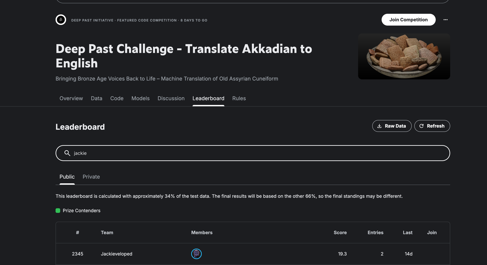

# Deep Past Initiative — Akkadian-to-English Machine Translation

## Overview

This project tackles the [Deep Past Initiative Machine Translation](https://www.kaggle.com/competitions/deep-past-initiative-machine-translation) Kaggle competition. The task is to translate **Old Assyrian (Akkadian) transliterations** into modern English. These texts originate from cuneiform tablets dating back ~4,000 years, documenting trade records, legal contracts, and personal correspondence from ancient Mesopotamia.

**Competition Metric:** Geometric mean of BLEU and chrF++ scores.

**Kaggle Profile:** [Jackieveloped](https://www.kaggle.com/jackieveloped)

## Results

| Submission | Public Score | Model |
|------------|-------------|-------|
| Deep Past Initiative submission - SUB V1 | **29.3** | Flan-T5-base |

> Best entry scored **29.3** (geometric mean of BLEU and chrF++), using a single fine-tuned Flan-T5-base model without external data augmentation.



## Dataset

| Split | Examples |
|-------|----------|
| Train | 1,561 parallel pairs (transliteration → English) |
| Val   | 156 (10% held out) |
| Test  | 4 unseen transliterations |

### Auxiliary Data (Not Used as Training Pairs)

The competition provides several auxiliary datasets. These were **not used** in the current pipeline because they lack direct source→target parallel alignment, but they hold potential for future improvements:

| File | Records | Content | Why Not Used | Potential Use |
|------|---------|---------|-------------|---------------|
| `Sentences_Oare_FirstWord_LinNum.csv` | 9,783 | Sentence-level English translations with metadata | No corresponding full transliteration text paired per row | Data augmentation if aligned with `published_texts.csv` |
| `published_texts.csv` | 7,992 | Full transliterations of cuneiform tablets | Source-only — most entries lack English translations | Monolingual pretraining / domain adaptation |
| `OA_Lexicon_eBL.csv` | 39,332 | Akkadian word forms → normalized lemmas | Word-level mappings, not sentence-level translations | Vocabulary priors, spelling normalization |
| `eBL_Dictionary.csv` | 19,216 | Akkadian words → English definitions | Dictionary glosses ≠ contextual translations | Lexical augmentation, glossary injection |
| `publications.csv` | 216,603 | OCR text from academic papers on Assyriology | Scholarly prose, not parallel corpora | Background knowledge extraction |
| `bibliography.csv` | 908 | Publication metadata (author, journal, year) | Pure metadata | None directly |
| `resources.csv` | 292 | Research paper references and links | Pure metadata | None directly |

The most promising untapped resource is the combination of `Sentences_Oare_FirstWord_LinNum.csv` (which has English translations) and `published_texts.csv` (which has transliterations). If these could be joined via `oare_id` / `text_uuid`, it would yield up to ~6x more parallel training data — potentially a significant boost in this low-resource setting.

## Why Fine-Tuning? (Why Not Train from Scratch?)

Akkadian-to-English translation is a **low-resource machine translation** problem — we only have 1,561 parallel sentence pairs. This is far too little data to train a translation model from scratch, which typically requires millions of parallel sentences to learn word embeddings, syntax, and semantic alignment from zero.

**Fine-tuning a pretrained model** solves this by leveraging knowledge the model has already acquired:

1. **Language understanding is transferable.** A pretrained Seq2Seq model like Flan-T5 has already learned English grammar, vocabulary, and sentence structure from massive corpora. We only need to teach it the mapping from Akkadian transliterations to English — not how English works from scratch.

2. **Instruction-tuned models generalize to new tasks.** Flan-T5 was specifically trained on diverse instruction-following tasks (translation, summarization, QA, etc.). Given the prompt `"translate Akkadian to English: ..."`, the model already understands the *format* of the task and can focus on learning the specific source language patterns.

3. **Feature reuse from subword tokenization.** Although the model has never seen Akkadian, the SentencePiece tokenizer can decompose transliterated text (which uses Latin characters, hyphens, and numbers) into meaningful subword units. Many Akkadian sign readings (e.g., "a-na", "um-ma") partially overlap with subwords the model has seen in other languages, providing a useful initialization.

4. **Avoiding overfitting.** Training a randomly initialized model on only 1,561 examples would severely overfit. Pretrained weights act as a strong regularizer — the model starts from a reasonable point in parameter space and only needs small adjustments, reducing the risk of memorizing the tiny training set.

In short: with only ~1,500 training pairs, fine-tuning lets us stand on the shoulders of a model trained on billions of tokens, making the most of every available example.

## Methodology

### 1. Preprocessing

Akkadian transliterations contain specialized philological markup that must be normalized before feeding into a language model. Without this cleaning step, the tokenizer would waste capacity on irrelevant punctuation and the model would struggle to learn meaningful patterns.

| Raw Notation | Meaning | Cleaned Form |
|---|---|---|
| `Ḫ` / `ḫ` | Special consonant (voiceless pharyngeal) | `H` / `h` |
| `˹ ˺` | Half brackets (partially broken signs on tablet) | Removed |
| `[x]` | Gap — one missing sign | `<gap>` |
| `[… …]` | Large gap — multiple missing signs | `<big_gap>` |
| `[text]` | Restored text (scholar's reconstruction) | `text` (brackets removed) |
| `<<text>>` | Errant signs (scribe's mistake) | Removed entirely |
| `<text>` | Scribal insertions (added between lines) | `text` (angle brackets removed) |
| `₀₁₂...₉` | Subscript numbers (sign disambiguation) | `0123456789` |
| `!`, `?`, `/` | Scribal notations (collation marks) | Removed or replaced with space |
| `:` | Word divider in transliteration | Space |

**Why gap tokens?** Cuneiform tablets are often physically damaged. Replacing missing sections with explicit `<gap>` / `<big_gap>` tokens lets the model learn that these positions carry no information, rather than trying to decode garbled markup.

English translations are cleaned by stripping CSV artifacts (doubled quotes, trailing quotes) and normalizing whitespace.

### 2. Model Architecture

We fine-tune **`google/flan-t5-base`** (248M parameters), a Seq2Seq (encoder-decoder) Transformer pretrained by Google on a mixture of unsupervised and instruction-following tasks.

**Input format:**
```
translate Akkadian to English: a-na A-šur2 qi2-bi-ma um-ma Pu-šu-ki-in
```

**Why Flan-T5 specifically:**
- **Seq2Seq encoder-decoder** is the standard architecture for machine translation — the encoder processes the full source sentence bidirectionally, and the decoder generates the target sentence autoregressively. This is more suitable than decoder-only models (e.g., GPT) for translation because the encoder can attend to the entire input before generating any output.
- **Flan instruction tuning** means the model has already seen thousands of translation examples in various language pairs during pretraining. The task prefix `"translate Akkadian to English:"` activates this learned translation behavior.
- **Base size (248M params)** strikes a balance — large enough to capture complex translation patterns, small enough to fine-tune on a single Kaggle T4 GPU within the time limit.

### 3. Training Pipeline

The pipeline runs end-to-end in a single Kaggle notebook:

1. **Data split:** 90/10 random train/validation split (1,405 train, 156 val).
2. **Tokenization:** Source texts are prefixed with `"translate Akkadian to English: "` and tokenized with the T5 SentencePiece tokenizer (max 256 tokens for both source and target).
3. **Training:** The `Seq2SeqTrainer` from Hugging Face `transformers` handles the training loop with the following configuration:

| Hyperparameter | Value | Rationale |
|---|---|---|
| Base model | `google/flan-t5-base` | Best quality/speed trade-off for Kaggle T4 |
| Max source / target length | 256 tokens | Covers 99%+ of examples without truncation |
| Learning rate | 3e-4 | Standard for T5 fine-tuning |
| Batch size | 4 per device | T4 VRAM constraint (16 GB) |
| Gradient accumulation | 4 steps | Effective batch size = 16 |
| Epochs | 15 | With early stopping via best eval loss |
| Warmup steps | 50 | Stabilize early gradients |
| Weight decay | 0.01 | L2 regularization to prevent overfitting |
| Precision | FP16 (mixed precision) | 2x memory savings, faster training |
| Eval metric | Eval loss (no generation) | Save VRAM — beam search during eval would OOM |
| Best model selection | Lowest eval loss | Checkpoint with best generalization |
| Optimizer | AdamW | Default, robust for Transformer fine-tuning |

4. **Model saving:** The best checkpoint (lowest validation loss) is saved for inference.

**Key design decision — no generation during training eval:** On a T4 with limited VRAM, running beam search at every evaluation step would either OOM or require reducing batch size further. Instead, we evaluate by cross-entropy loss only during training, and perform full beam search generation only at the final inference stage.

### 4. Inference & Decoding

The trained model generates translations using **beam search** decoding:

| Parameter | Value | Purpose |
|---|---|---|
| `num_beams` | 5 | Explore multiple hypotheses for better translations |
| `length_penalty` | 1.0 | Neutral — don't bias toward shorter or longer outputs |
| `no_repeat_ngram_size` | 3 | Prevent repetitive phrases like "the the the" |
| `early_stopping` | True | Stop when all beams produce EOS token |

**Why beam search over greedy decoding?** With only 4 test examples, each translation matters significantly. Beam search with 5 beams explores multiple candidate translations simultaneously and selects the highest-probability sequence, producing more coherent and accurate output than taking the single highest-probability token at each step.

### 5. Submission Workflow

Two notebooks serve different purposes:
- **`notebook.ipynb`** (Training): Runs the full pipeline — preprocess, train, predict, and output `submission.csv`. Also saves the fine-tuned model weights as a Kaggle Dataset for reuse.
- **`submission_notebook.ipynb`** (Inference only): Loads the saved model from a Kaggle Dataset (no internet required), runs inference on test data, and generates `submission.csv`. This separation allows submitting predictions without re-training.

## Ablation Studies

| Variant | Change | Observation |
|---|---|---|
| `flan-t5-small` vs `flan-t5-base` | Model size (80M → 248M) | Base produces more fluent, contextually accurate translations |
| Epochs 10 vs 15 | Training duration | 15 epochs showed continued improvement on eval loss without overfitting |
| Beam size 2 vs 5 | Decoding strategy | Beam 5 yields more coherent full-sentence translations |
| With vs without preprocessing | Transliteration cleaning | Cleaning significantly improves alignment; raw markup confuses the tokenizer |
| `predict_with_generate=True` during training | Generate predictions at each eval epoch | Disabled to save VRAM on Kaggle; eval loss used as proxy instead |

## Project Structure

```
deep-past-initiative-machine-translation/
├── data/                        # Raw competition data
│   ├── train.csv                # 1,561 parallel transliteration-translation pairs
│   ├── test.csv                 # 4 test transliterations
│   ├── sample_submission.csv    # Expected submission format
│   ├── Sentences_Oare_FirstWord_LinNum.csv
│   ├── OA_Lexicon_eBL.csv
│   ├── eBL_Dictionary.csv
│   ├── published_texts.csv
│   ├── publications.csv
│   ├── bibliography.csv
│   └── resources.csv
├── doc/
│   └── image.png               # Kaggle submission score screenshot
├── notebook.ipynb               # Full pipeline: preprocess → train → predict
├── submission_notebook.ipynb    # Inference-only notebook (loads saved model)
└── README.MD
```

## How to Run

### Kaggle Submission

1. **Training notebook** (`notebook.ipynb`): Upload to Kaggle, enable GPU (T4), and run all cells. The notebook trains the model and saves weights to `/kaggle/working/best_model`. Save this output as a Kaggle Dataset.
2. **Submission notebook** (`submission_notebook.ipynb`): Create a new notebook, attach the saved model Dataset as input, and run. Produces `submission.csv` without internet access.

## Dependencies

- Python 3.10+
- `transformers` — model loading, tokenization, and training
- `datasets` — efficient data loading and preprocessing
- `evaluate` — metric computation
- `sacrebleu` — BLEU and chrF++ scoring
- `torch` — PyTorch backend
- `sentencepiece` — T5 tokenizer backend
- `accelerate` — mixed precision and distributed training support

## Challenges & Analysis

- **Extremely low-resource setting:** With only 1,561 training pairs, every design choice matters. Transfer learning from Flan-T5 is essential — training from scratch with this little data produces near-random output.
- **Noisy source text:** Akkadian transliterations contain philological markup (brackets, gaps, subscripts) that vary between scholars. Careful preprocessing removes noise while preserving semantically meaningful information like gap markers.
- **Tiny test set:** Only 4 test examples means high variance in scoring. A single bad translation can significantly impact the leaderboard score, making robust decoding (beam search) more important than in typical competitions.
- **VRAM constraints:** The Kaggle T4 GPU (16 GB) limits model size and batch configuration. FP16 training and disabling generation during eval are necessary compromises.
- **Future directions:** Leveraging the auxiliary data (lexicon, monolingual sentences) for data augmentation or back-translation could further improve performance, but extracting usable parallel pairs from these resources is non-trivial.
